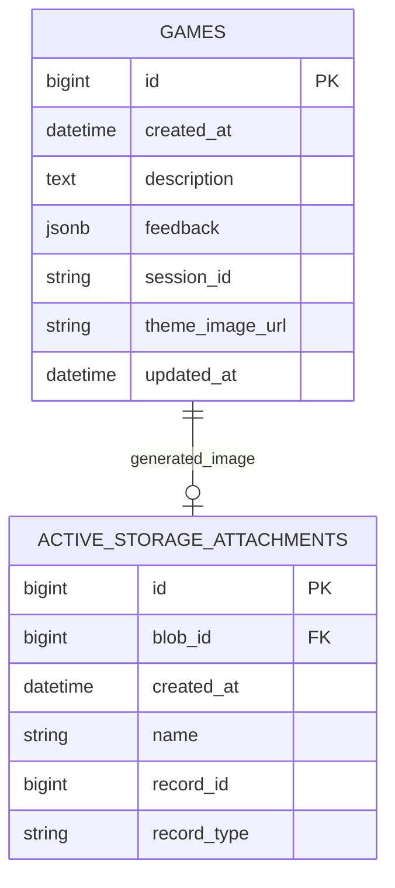

# 「Describe This」
### 概要

- 英語学習に 伝言ゲームのような遊び を提供します。
	- ゲームプレイを通して、
	  「自分の 英語 がどんなイメージで相手(AI)に伝わるのか視覚的に確認 → フィードバックによって言葉の使い方を学習 → 学びを次のプレイで実践」というサイクルを体験します。

---
### 開発の背景

- 英語学習を再開してから、どの程度使えるのか確かめたくなった時に、 対人では緊張して英語そのものを満足に使えない自分には別の確認方法が必要だと感じました。
- まともに英語を使えるレベルではないので、AI相手であれば気楽に確認できると考えました。しかし、AIは使用者に話を合わせてくれるので、言葉を意図したイメージでAIが受け取ったのか、それともAIが不自然に合わせたのか疑心になりました。画像生成という形で、自分の言葉に対するリアクションが返ってくれば、今の言葉はこんなイメージに直結するのかと確認がしやすいですし、ゲーム感覚で面白いなと考えたのがきっかけです。

---
### 技術構成

| カテゴリ       | 使用技術                             |
| ---------- | -------------------------------- |
| フロントエンド    | Hotwire / JavaScript             |
| CSSフレームワーク | DaisyUI                          |
| バックエンド    | Ruby 4.0.5 / Ruby on Rails 8.1.3 |
| データベース     | PostgreSQL 18.3                  |
| 外部API      | DeepInfra / OpenAI / Cloudinary  |
| バージョン管理ツール | GitHub                           |
| デプロイ       | Render(App) / Neon(DB)           |

---
### 画面遷移図
Figma：[URL](https://www.figma.com/design/Ww2Wdo9hGjPXsq2QVxKj63/%E7%94%BB%E9%9D%A2%E9%81%B7%E7%A7%BB%E5%9B%B3_Describe_This?node-id=0-1&t=l0rquhdLDyCqAHvG-1)

---
### ER図

---
### 今後の実装予定
- ユーザー
	- 新規登録機能
	- ログイン機能
	- ゲスト機能
- ゲーム本編
	- 生成画像を訂正させる機能（2回まで）
	- 音声入力
	- 判定（伝達成功 か 失敗 か）
	- 難易度
	- 質問タイム（10回まで質問可）
- プレイ履歴
- 言語設定（UI と 練習言語 を別々に設定できる）
- 問い合わせフォーム
