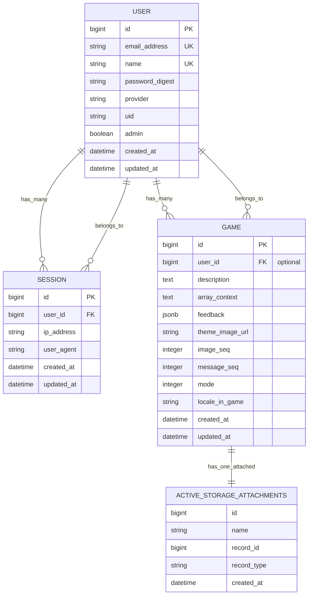

# 「Describe This」
### 概要

- 英語学習に 伝言ゲームのような遊び を提供します。
	- ゲームプレイを通して、
	  「自分の 英語 がどんなイメージで相手(AI)に伝わるのか視覚的に確認 → フィードバックによって言葉の使い方を学習 → 学びを次のプレイで実践」というサイクルを体験します。

---
### 開発の背景

- 英語学習を再開してから、対人では緊張して英語そのものを満足に使えない自分にはもっと負荷の軽い練習方法が必要だと感じました。
- AI相手であれば気楽に確認できますが、AIは使用者に話を合わせてくれるので、言葉を意図したイメージでAIが受け取ったのか、それともAIが不自然に合わせたのか疑心になりました。画像生成という形で、自分の言葉に対するリアクションが返ってくれば、今の言葉はこんなイメージに直結するのかと確認がしやすいですし、ゲーム感覚で面白いなと考えたのがきっかけです。
- 英語に限らず他の言語練習にも使えたら、私と似た悩みを持つ他の言語学習者の役に立てて更に良いなと思い、将来は対応言語を増やす予定です。

---
### 技術構成

| カテゴリ           | 使用技術                                                  |
| -------------- | ----------------------------------------------------- |
| フロントエンド        | Hotwire (Turbo Rails / Stimulus Rails) / JavaScript   |
| CSSフレームワーク     | Tailwind CSS / DaisyUI                                |
| バックエンド         | Ruby 3.4 / Ruby on Rails 8.1.3 / Puma                 |
| データベース         | PostgreSQL                                            |
| キャッシュ & ジョブキュー | Solid Cache / Solid Queue                             |
| 外部API          | OpenAI / Cloudinary / Google OAuth2                   |
| ストレージ          | Active Storage (Cloudinary)                           |
| 言語検出           | CLD3 (Google Compact Language Detector v3)            |
| 認証             | Bcrypt / OmniAuth                                     |
| 管理画面           | Avo                                                   |
| テスト            | RSpec / Capybara / FactoryBot / Faker / WebMock / VCR |
| セキュリティ         | Brakeman / Bundler Audit                              |
| リント            | RuboCop / ESLint                                      |
| バージョン管理ツール     | GitHub                                                |
| デプロイ           | Render(App) / Neon(DB)                                |

---
### 画面遷移図
Figma：[URL](https://www.figma.com/design/Ww2Wdo9hGjPXsq2QVxKj63/%E7%94%BB%E9%9D%A2%E9%81%B7%E7%A7%BB%E5%9B%B3_Describe_This?node-id=0-1&t=l0rquhdLDyCqAHvG-1)

---
### ER図

```mermaid
erDiagram
    USER ||--o{ SESSION : has_many
    USER ||--o{ GAME : has_many
    GAME }o--|| USER : belongs_to
    SESSION }o--|| USER : belongs_to
    GAME ||--|| ACTIVE_STORAGE_ATTACHMENTS : has_one_attached

    USER {
        bigint id PK
        string email_address UK
        string name UK
        string password_digest
        string provider
        string uid
        boolean admin
        datetime created_at
        datetime updated_at
    }

    SESSION {
        bigint id PK
        bigint user_id FK
        string ip_address
        string user_agent
        datetime created_at
        datetime updated_at
    }

    GAME {
        bigint id PK
        bigint user_id FK "optional"
        text description
        text array_context
        jsonb feedback
        string theme_image_url
        integer image_seq
        integer message_seq
        integer mode
        string locale_in_game
        datetime created_at
        datetime updated_at
    }

    ACTIVE_STORAGE_ATTACHMENTS {
        bigint id
        string name
        bigint record_id
        string record_type
        datetime created_at
    }
```
---
### テストカバレッジ

---
### 今後の実装予定
- 不具合修正
- プレイ体験の最適化
  - 画面の固まりを減らす対応
  - お題の種類を増やす対応　など
- 対応言語追加
  - 韓国語、中国語、スペイン語など
